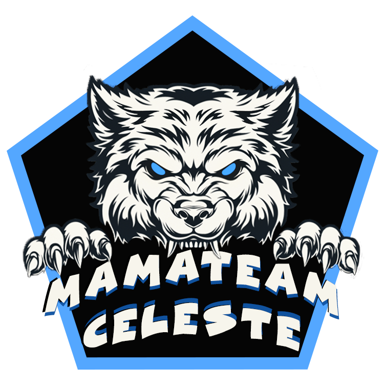
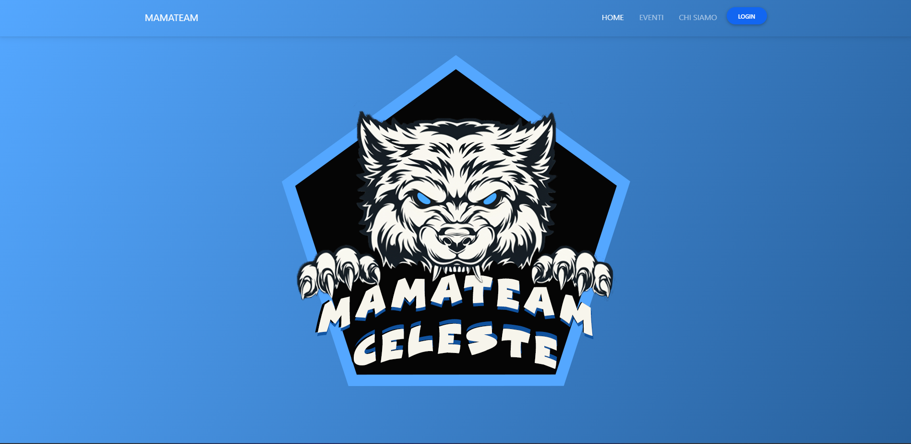
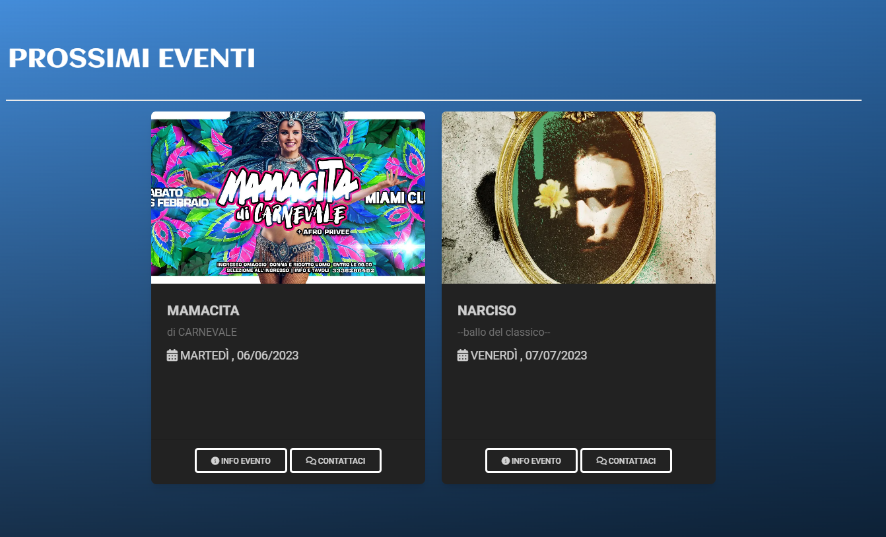
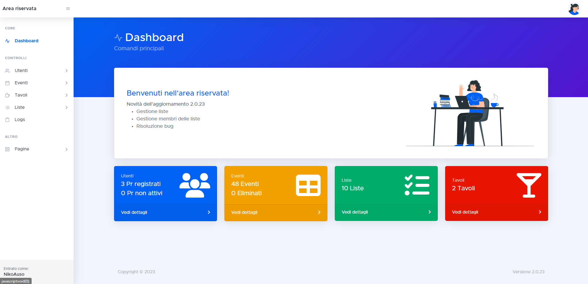
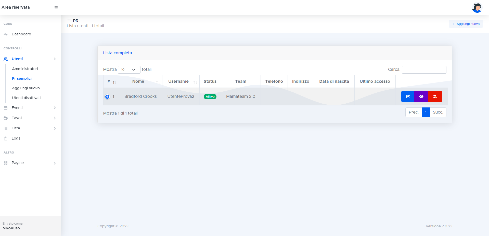
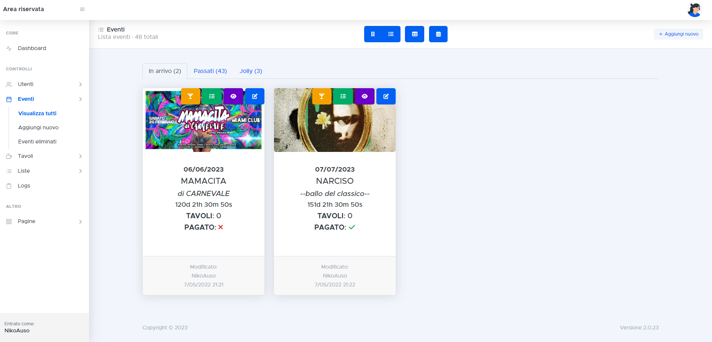
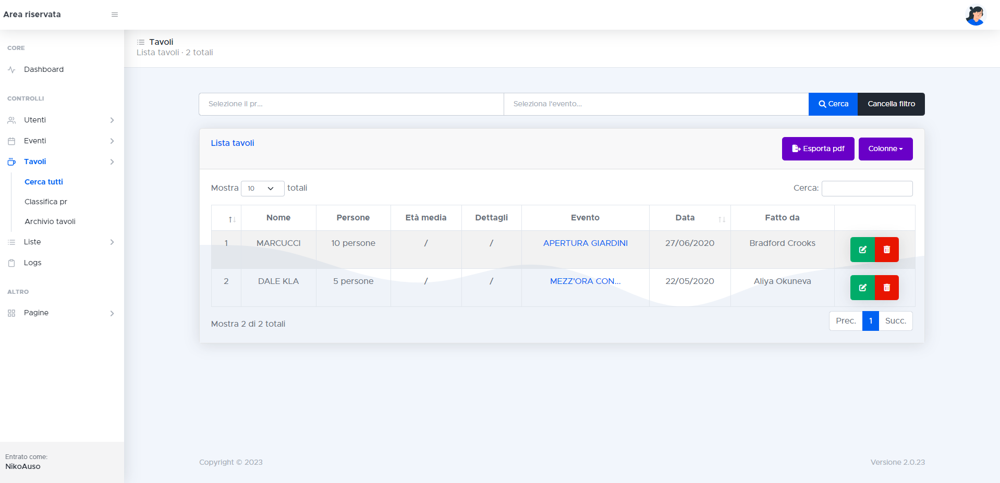
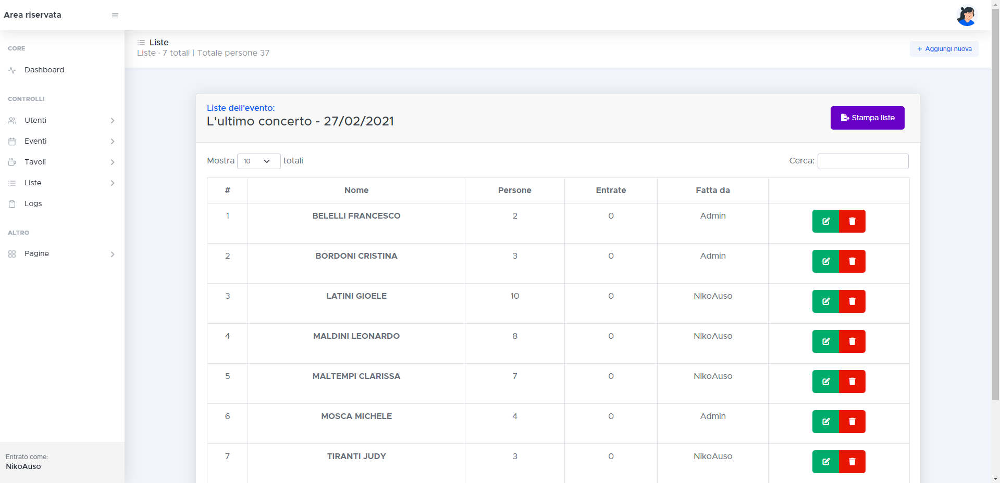
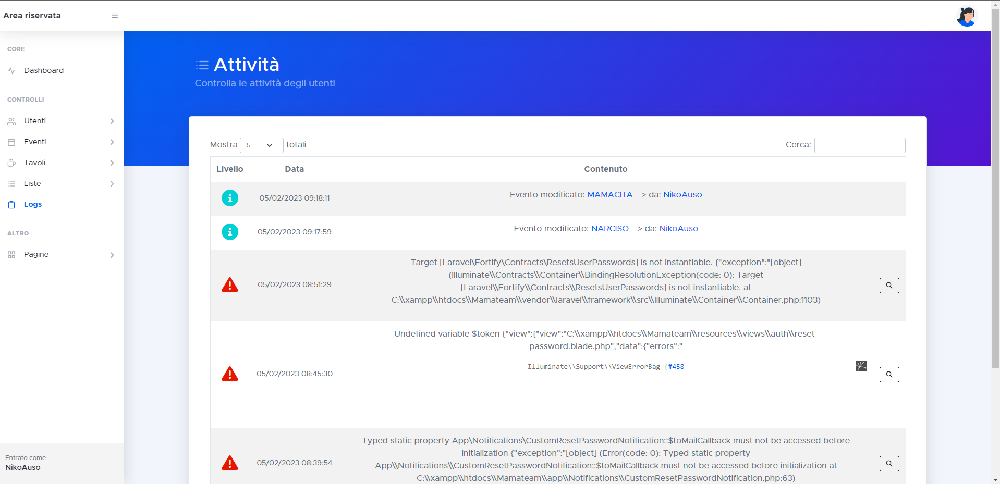

[][license-url]

<!-- LOGO DEL PROGETTO -->
 

  

<h1 align="center">MAMATEAM</h1>

<!-- ABOUT THE PROJECT -->

## Costruito con

[![HTML5][HTML5.com]][HTML5-url]
[![Bootstrap][Bootstrap.com]][Bootstrap-url]
[![JQuery][JQuery.com]][JQuery-url]
[![Laravel][Laravel.com]][Laravel-url]
[![Composer][Composer.com]][Composer-url]
[![Font-awesome][Font-Awesome.com]][Font-Awesome-url]

Il sito Mamateam/Celeste è un sito vetrina di un team che si occupa di pubbliche relazioni per diverse discoteche nella
provincia di Ancona.
All'interno del sito vengono pubblicati tutti i futuri eventi di queste discoteche con tutti i relativi dettagli.
Il sito è anche una PWA che permette agli utenti registrati di accedere alla dashboard direttamente dall'app.

## Author
👤 [**Nicolò Ausili**](https://github.com/NikoAuso)

## Descrizione

Il sito è un'applicazione web multi-pagina sviluppata in Laravel, un framework PHP che gestisce l'applicazione secondo
un pattern MVC.

Ho scelto di utilizzare Laravel perchè dopo attente ricerche ho trovato in Laravel ciò che mi serviva in quanto
semplifica alcune delle attività più comuni dei progetti web, come autenticazione, autorizzazione, routing, sessioni,
caching. Possiede inoltre un motore di templating integrato, Blade, un sistema di migrazione database, integrazione con
PHPUnit per il testing, e una propria interfaccia a riga di comando, chiamata Artisan CLI.

L'applicazione è completamente *responsive* grazie all'utilizzo di [Bootstrap](https://getbootstrap.com/) come framework
CSS e JS.

### Homepage

Nella Homepage il cliente finale può visualizzare tutti gli eventi disponibili nelle discoteche che il team pubblicizza,
ognuno con tutti i relativi dettagli.
In particolare vengono visualizzati:

* Nome
* Data e orario di apertura porte
* Luogo
* Costi dell'ingresso
* Un pulsante che rimanda alla pagina Instagram con cui poter comunicare per avere maggiori informazioni

Scorrendo la pagina verso il basso, viene visualizzata una sezione in cui viene raccontata la storia del team.

Ancora sotto, si trova la sezione che elenca i nomi e i relativi contatti di tutti i referenti del team.

E per finire una sezione per la polizza sulla privacy.

### Login

I membri del team possono accedere all'area riservata.

L'applicazione mette a disposizione 3 tipi di accesso:

* **super-admin**: è in grado di visualizzare, creare, modificare, eliminare utenti, eventi. liste o tavoli;
* **admin**: è in grado di visualizzare, creare, modificare, eliminare utenti, eventi. liste o tavoli. Non può cambiare
  ruolo agli altri utenti e non può modificare utenti di tipo *super-admin*;
* **pr** (ancora in fase di implementazione): è in grado di prenotare (creare) un tavolo o una lista per un evento. Può
  inoltre visualizzare tutti i tavoli e le liste da lui create in passato.

E' inoltre possibile resettare la password qualora fosse stata smarrita/dimenticata. Il sistema invierà un'email all'
indirizzo specificato, se esiste nel database.

### Area Riservata

Inizialmente verrà visualizzata la dashboard, nella quale vengono mostrate le statistiche di utenti registrati, eventi,
tavoli e liste presenti nel database.

Nell'area riservata, l'utente registrato potrà, a seconda del ruolo, interagire con le varie componenti.

* **UTENTI**: viene visualizzata una lista di tutti gli utenti registrati. Sono presenti due liste: una mostra gli
  utenti di tipo *admin* che può essere visualizzata solo da utenti di tipo *super-admin*, e una seconda mostra tutti
  gli utenti di tipo *pr* che può essere visualizzata sia da utenti *admin* che *super-admin*. L'utente *pr* non vedrà
  questa lista. L'utente di tipo *admin* o *super-admin* potrà:
    * creare un nuovo utente
    * modificare un utente già esistente
    * attivare/disattivare un utente
    * eliminare definitivamente un utente

  L'utente *super-admin* potrà anche modificare il ruolo di qualsiasi utente.

* **EVENTI**: viene visualizzato un elenco con tutti gli eventi in programma, quelli passati e quelli di un tipo
  particolare detto *Jolly*, ovvero quegli eventi che sono \"extra-discoteche\". E' possibile visualizzare gli eventi in
  diverse maniere come, ad esempio, in versione elenco, griglia, tabella e calendario. Per ogni evento sono presenti
  diversi pulsanti che indicano rispettivamente:
    * "bicchiere martini" => tavoli registrati per quell'evento;
    * "elenco puntato" => liste registrate per quell'evento;
    * "occhio" => rimanda alla pagina dei dettagli dell'evento;
    * "matita e taccuino" => rimanda alla pagina per modificare le informazioni dell'evento.

  Gli utenti di tipo *super-admin* e *admin* possono:
    * creare un nuovo evento
    * modificare i dettagli di un evento già esistente
    * eliminare l'evento
    * ripristinare un evento eliminato
    * eliminare definitivamente un evento eliminato

* **LISTE**: (ancora in fase di sviluppo) viene visualizzato un elenco degli eventi che hanno delle liste. Premendo sul
  pulsante si verrà reindirizzati alla pagina con tutte le liste di quello specifico evento. Ogni tipo di utente sarà in
  grado di:
    * inserire una nuova lista per ogni evento;
    * modificare una lista già esistente creata da quell'utente (gli *admin* e i *super-admin* possono modificare
      qualsiasi lista);
    * eliminare una lista già esistente creata da quell'utente (gli *admin* e i *super-admin* possono eliminare
      qualsiasi lista);

* **TAVOLI**: viene visualizzata una tabella di tutti i tavoli presenti nel database. È possibile cercare tavoli per
  evento, per pr creatore del tavolo o per entrambi. Nella tabella, ogni tavolo avrà come dettaglio il nome del tavolo,
  il numero delle persone in quel tavolo, l'evento a cui è associato il tavolo e il pr che ha effettuato la prenotazione
  del tavolo. Ogni tipo di utente sarà in grado di:
    * inserire un nuovo tavolo per ogni evento;
    * modificare un tavolo già esistente creato da quell'utente (gli *admin* e i *super-admin* possono modificare
      qualsiasi tavolo);
    * eliminare un tavolo già esistente creato da quell'utente (gli *admin* e i *super-admin* possono eliminare
      qualsiasi tavolo).

  Inoltre è disponibile una classifica che si basa sulla quantità di tavoli fatti per ogni pr nella stagione corrente.
  Infine, per ogni stagione è disponibile un "archivio" contente i dettagli dei tavoli delle stagioni passate.

* **LOGGING SYSTEM**: ogni azione eseguita da un utente è registrata nei file di log di Laravel. Tutte le azioni
  compiute
  sono visualizzabili attraverso l'interfaccia **Logs**.

> Il progetto è ancora in fase di sviluppo. Nei prossimi aggiornamenti vorrei inserire innanzitutto una nuova grafica
> per la homepage di cui ho già
> un [concept](https://www.figma.com/file/sA1yHloOcHvikVttXss01T/Landing-page---Desktop-view?node-id=0%3A1&t=hvOWr0eSrRxKHOkA-1). 

## Screenshot

<!-- MARKDOWN LINKS & IMAGES -->
<!-- https://www.markdownguide.org/basic-syntax/#reference-style-links -->

[license-url]: https://github.com/git/git-scm.com/blob/main/MIT-LICENSE.txt

[Laravel.com]: https://img.shields.io/badge/Laravel-FF2D20?style=for-the-badge&logo=laravel&logoColor=white

[Laravel-url]: https://laravel.com

[Bootstrap.com]: https://img.shields.io/badge/Bootstrap-563D7C?style=for-the-badge&logo=bootstrap&logoColor=white

[Bootstrap-url]: https://getbootstrap.com

[JQuery.com]: https://img.shields.io/badge/jQuery-0769AD?style=for-the-badge&logo=jquery&logoColor=white

[JQuery-url]: https://jquery.com

[Composer.com]: https://img.shields.io/badge/Composer-885630?style=for-the-badge&logo=Composer&logoColor=white

[Composer-url]: https://getcomposer.org/

[Font-Awesome.com]: https://img.shields.io/badge/Font_Awesome-339AF0?style=for-the-badge&logo=fontawesome&logoColor=white

[Font-Awesome-url]: https://fontawesome.com/

[HTML5.com]: https://img.shields.io/badge/HTML5-E34F26?style=for-the-badge&logo=html5&logoColor=white

[HTML5-url]: http://www.html5.com/
